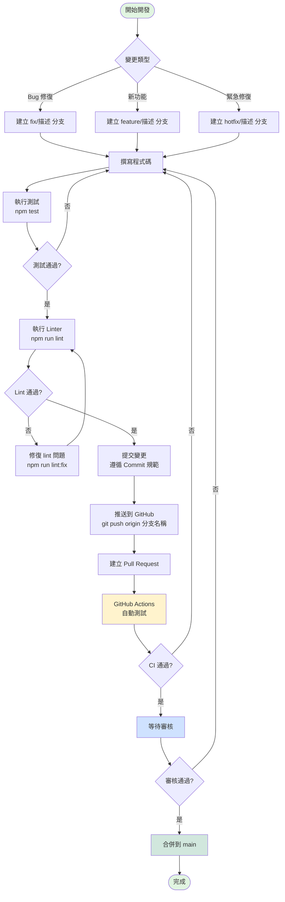
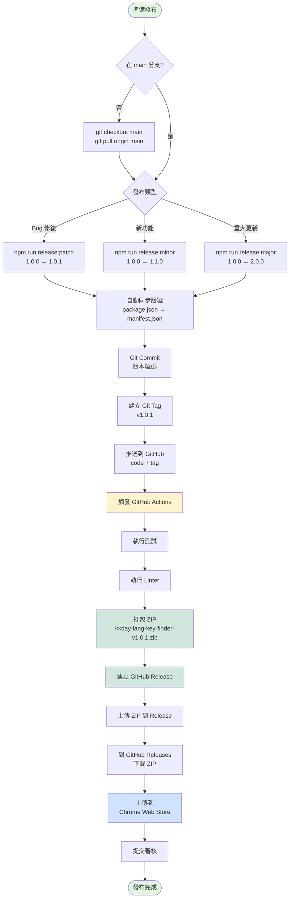
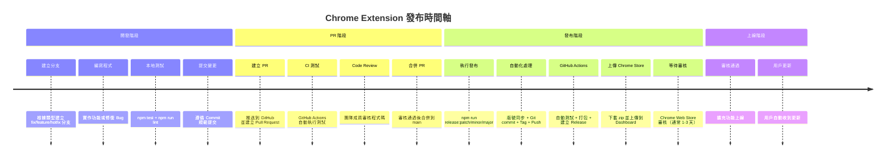

# 貢獻指南 (Contributing Guide)

感謝你願意為 KKday Lang Key Finder 做出貢獻！本文件說明如何參與開發。

## 📋 目錄

- [開發環境設置](#開發環境設置)
- [Git 工作流程](#git-工作流程)
- [Commit 規範](#commit-規範)
- [版本發布流程](#版本發布流程)
- [測試要求](#測試要求)

## 🛠 開發環境設置

### 1. Fork 並 Clone 專案

```bash
git clone https://github.com/你的帳號/kkday-lang-key-finder.git
cd kkday-lang-key-finder
```

### 2. 安裝依賴

```bash
npm install
```

### 3. 載入擴充功能到 Chrome

1. 開啟 Chrome，進入 `chrome://extensions/`
2. 開啟「開發人員模式」
3. 點選「載入未封裝項目」
4. 選擇專案目錄

### 4. 執行測試

```bash
npm test                # 執行所有測試
npm run lint            # 檢查程式碼風格
npm run dev             # 自動修復 lint 並格式化
```

## 🌿 Git 工作流程

### 流程總覽



### Branch 命名規則

我們使用簡化版的 Git Flow：

- `main` - 生產版本，隨時可發布
- `fix/描述` - Bug 修復分支
- `feature/描述` - 新功能分支
- `hotfix/描述` - 緊急修復分支

### 開發流程範例

#### 修復 Bug

```bash
# 1. 從 main 建立 fix 分支
git checkout main
git pull origin main
git checkout -b fix/context-menu-not-working

# 2. 修改程式碼
# ...

# 3. 執行測試
npm test
npm run lint

# 4. 提交變更
git add .
git commit -m "fix: context menu not working after extension reload"

# 5. 推送到 GitHub
git push origin fix/context-menu-not-working

# 6. 建立 Pull Request
# - 前往 GitHub 建立 PR
# - 目標分支: main
# - 等待 CI 測試通過
# - 等待審核

# 7. PR 合併後，本地更新
git checkout main
git pull origin main
git branch -d fix/context-menu-not-working
```

#### 開發新功能

```bash
# 1. 建立 feature 分支
git checkout -b feature/export-translations

# 2. 開發功能
# ...

# 3. 測試並提交
npm test
git commit -m "feat: add export translations to CSV"

# 4. 推送並建立 PR
git push origin feature/export-translations
```

## 📝 Commit 規範

我們遵循 [Conventional Commits](https://www.conventionalcommits.org/) 規範：

### Commit 類型

- `feat:` - 新功能
- `fix:` - Bug 修復
- `docs:` - 文檔更新
- `style:` - 程式碼格式調整（不影響功能）
- `refactor:` - 重構（不是新功能也不是修復）
- `perf:` - 效能改進
- `test:` - 測試相關
- `chore:` - 建置或輔助工具變更

### Commit 訊息範例

```bash
feat: add right-click context menu search
fix: context menu not working after reload
docs: update README with new features
style: format code with prettier
refactor: simplify search algorithm
perf: optimize fuzzy search performance
test: add unit tests for DataExtractionService
chore: update dependencies
```

### 完整格式

```
<type>(<scope>): <subject>

<body>

<footer>
```

範例：
```
feat(search): add Fuse.js fuzzy search

- Replace simple string matching with Fuse.js
- Configure optimal weights (val: 0.7, key: 0.3)
- Improve search accuracy

Closes #123
```

## 🚀 版本發布流程

### 發布流程總覽



### 版號規則 (Semantic Versioning)

- **Major (1.x.x)** - 重大更新、不向下相容的變更
- **Minor (x.1.x)** - 新功能、向下相容
- **Patch (x.x.1)** - Bug 修復、小改進

### 發布步驟

**只有專案維護者可以發布新版本。**

#### 1. 發布 Patch 版本（Bug 修復）

```bash
# 確保在 main 分支並且是最新狀態
git checkout main
git pull origin main

# 一鍵發布 patch 版本
npm run release:patch

# 這會自動：
# - package.json: 1.0.0 → 1.0.1
# - 同步 manifest.json
# - Git commit "1.0.1"
# - Git tag v1.0.1
# - Push code + tag
# - 觸發 GitHub Actions 自動打包發布
```

#### 2. 發布 Minor 版本（新功能）

```bash
npm run release:minor  # 1.0.1 → 1.1.0
```

#### 3. 發布 Major 版本（重大更新）

```bash
npm run release:major  # 1.1.0 → 2.0.0
```

### GitHub Actions 自動化

當你推送 tag 時（如 `v1.0.1`），GitHub Actions 會自動：

1. ✅ 執行測試
2. ✅ 執行 linter
3. ✅ 打包 zip 檔案
4. ✅ 建立 GitHub Release
5. ✅ 上傳 zip 到 Release（可直接下載上傳到 Chrome Store）

### 完整時間軸



### 上傳到 Chrome Web Store

1. 到 GitHub Releases 下載最新的 zip 檔案
2. 前往 [Chrome Web Store Developer Dashboard](https://chrome.google.com/webstore/devconsole)
3. 選擇擴充功能
4. 上傳新的 zip 檔案
5. 提交審核

## ✅ 測試要求

### PR 合併前的檢查清單

- [ ] 所有測試通過 (`npm test`)
- [ ] Linter 無錯誤 (`npm run lint`)
- [ ] 版號已同步（package.json 與 manifest.json 一致）
- [ ] 功能在 Chrome 中測試正常
- [ ] Commit 訊息符合規範
- [ ] PR 描述清楚說明變更內容

### 測試指令

```bash
npm test                 # 執行所有測試
npm run test:watch       # 監聽模式
npm run test:coverage    # 產生覆蓋率報告
npm run lint             # 檢查程式碼風格
npm run lint:fix         # 自動修復 lint 問題
npm run format           # 格式化程式碼
npm run build            # 完整建置（lint + test）
```

### 測試涵蓋範圍

本專案包含以下自動化測試：

| 測試類型 | 目錄 | 說明 |
|---------|------|------|
| 單元測試 | `tests/unit/` | 測試個別函式和類別 |
| 效能測試 | `tests/performance/` | 驗證搜尋和資料處理效能 |
| 記憶體測試 | `tests/memory/` | 驗證記憶體使用符合要求 |
| 瀏覽器相容性 | `tests/browser/` | 檢查瀏覽器 API 相容性 |

所有測試都在 Node.js + jsdom 環境執行，並在 GitHub Actions CI 中自動測試。

**手動測試**: 完整的功能驗證清單請參考 [QUICKSTART.md](./QUICKSTART.md) 的「功能驗證清單」章節。

## 🐛 回報問題

發現 Bug？請到 [GitHub Issues](https://github.com/b12031106/kkday-lang-key-finder/issues) 建立新 issue：

1. 使用清楚的標題描述問題
2. 提供重現步驟
3. 說明預期行為與實際行為
4. 附上截圖（如果適用）
5. 提供環境資訊（Chrome 版本、作業系統）

## 💡 提出新功能

想要新功能？歡迎：

1. 先建立 issue 討論想法
2. 等待維護者回覆
3. 獲得認可後開始開發
4. 提交 PR

## 📞 聯絡方式

- GitHub Issues: [kkday-lang-key-finder/issues](https://github.com/b12031106/kkday-lang-key-finder/issues)
- Email: (專案維護者信箱)

---

感謝你的貢獻！🎉
