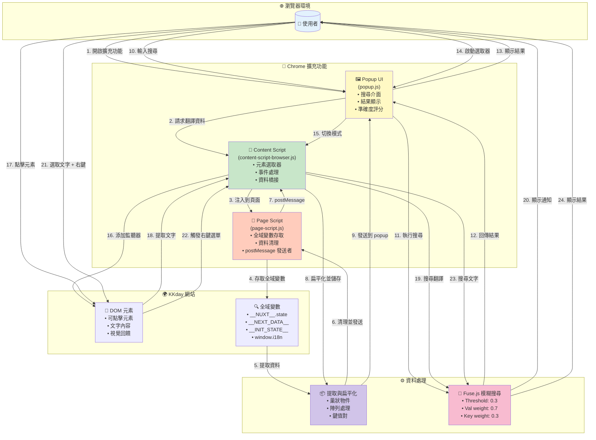

# KKday Lang Key Finder Chrome 擴充功能

一個專為幫助開發者在 KKday 網站上快速且高效地查找 i18n 翻譯鍵值的 Chrome 擴充功能。

## 功能特色

- 🔍 **模糊搜尋**：使用 Fuse.js 進行進階模糊搜尋，具備智能評分和權重配置
- 🎯 **元素選取器**：點擊任何元素即可立即找到對應的翻譯鍵值
- 🖱️ **右鍵選單搜尋**：選取文字後按右鍵即可直接搜尋翻譯鍵值
- 📋 **快速複製**：一鍵複製翻譯鍵值到剪貼簿
- 🌐 **多語言支援**：支援所有 KKday 語言版本
- ⚡ **即時搜尋**：輸入時即時顯示搜尋結果，並具有防抖動機制
- 🎨 **現代化介面**：簡潔響應式介面，具有視覺化準確度指示器
- 📊 **準確度評分**：彩色標籤顯示匹配準確度（90%+ 綠色、70-89% 橙色、<70% 藍色）
- 🔔 **智能通知**：頁面上的通知具有動態定位功能，避免遮擋游標

## 安裝方式

### 從原始碼安裝

1. Clone 此專案：

```bash
git clone https://github.com/b12031106/kkday-lang-key-finder.git
cd kkday-lang-key-finder
```

2. 安裝依賴套件：

```bash
npm install
```

3. 執行測試：

```bash
npm test
```

4. 在 Chrome 中載入擴充功能：
   - 開啟 Chrome 並前往 `chrome://extensions/`
   - 啟用「開發人員模式」
   - 點選「載入未封裝項目」
   - 選擇專案目錄

## 使用方式

### 基本搜尋

1. 前往任何 KKday 網站（例如：`https://www.kkday.com/zh-tw/product/123`）
2. 點擊工具列中的擴充功能圖示
3. 等待翻譯資料載入（您會在狀態列看到筆數）
4. 在搜尋框中輸入文字以找到匹配的翻譯鍵值
5. 點選任何結果旁的複製按鈕，將鍵值複製到剪貼簿

### 元素選取模式

1. 點擊工具列中的擴充功能圖示
2. 點選「選取頁面元素」按鈕
3. Popup 會關閉，頁面上會顯示通知
4. 將滑鼠懸停在元素上以突顯顯示
5. 點擊任何元素以找到其翻譯鍵值
6. 鍵值會自動複製，並顯示結果通知
7. 隨時按 ESC 鍵退出選取模式

### 右鍵選單搜尋

1. 在 KKday 網站上選取任何文字
2. 按右鍵並選擇「Search I18n Key for [選取的文字]」
3. 頁面上會顯示搜尋結果通知
4. 如果找到，翻譯鍵值會自動複製到剪貼簿
5. 無需先開啟 popup，直接就能使用！

### 了解準確度分數

搜尋結果會顯示準確度分數，幫助您找到最佳匹配：

- **90-100%（綠色）**：完全匹配或接近完全匹配
- **70-89%（橙色）**：良好的部分匹配
- **低於 70%（藍色）**：鬆散匹配，可能需要驗證

## 架構與工作流程

此擴充功能使用多層架構從 KKday 網站提取翻譯資料：



### 核心元件

#### 1. **Popup UI** (`popup.js`, `popup.html`, `popup.css`)

- 主要使用者介面，顯示搜尋框和結果
- 使用 Fuse.js 實作模糊搜尋
- 即時搜尋結果更新（帶防抖動）
- 彩色準確度標籤（綠色/橙色/藍色）
- 一鍵複製翻譯鍵值到剪貼簿
- 狀態指示器顯示連線狀態

#### 2. **Content Script** (`content-script-browser.js`)

- 在 KKday 頁面上執行的隔離腳本
- 注入 page script 以存取頁面全域變數
- 接收並處理來自 page script 的資料
- 扁平化巢狀翻譯物件為 `{key, val}` 對
- 管理元素選取模式
- 處理使用者互動（懸停、點擊、鍵盤）
- 顯示頁面上的通知

#### 3. **Page Script** (`page-script.js`)

- 在頁面上下文中執行以存取全域變數
- 從多個來源搜尋翻譯資料
- 深度清理物件以移除不可序列化的內容
- 透過 `window.postMessage` 傳送清理後的資料
- 延遲後重試提取以處理動態內容

#### 4. **Service Worker** (`service-worker-browser.js`)

- 管理擴充功能生命週期的背景腳本
- 處理安裝和更新
- 管理跨工作階段的持久狀態
- 在元件之間路由訊息
- 建立並處理右鍵選單

### 資料提取流程

1. **初始載入**：訪問 KKday 頁面時，content script 自動初始化
2. **腳本注入**：Content script 將 `page-script.js` 注入頁面上下文
3. **資料探索**：Page script 從多個來源搜尋翻譯資料：
   - `__NUXT__.state`（Vue/Nuxt 應用程式）
   - `__NEXT_DATA__.props.pageProps`（Next.js 應用程式）
   - `__INIT_STATE__.lang`（舊版應用程式）
   - 符合 i18n 模式的 Window 屬性
4. **資料清理**：深度清理以移除不可序列化的物件：
   - 過濾函式、DOM 節點、Window 物件
   - 處理循環參考
   - 限制遞迴深度以防止無限迴圈
5. **資料傳輸**：清理後的資料透過 `window.postMessage` 傳送給 content script
6. **資料處理**：Content script 將巢狀物件扁平化為 `{key, val}` 對
7. **延遲重試**：2 秒後再次嘗試提取動態內容
8. **使用者互動**：當 popup 開啟時，向 content script 請求處理後的資料
9. **模糊搜尋**：Popup 使用 Fuse.js 進行智能模糊匹配：
   - Threshold: 0.3（控制匹配靈敏度）
   - 翻譯文字（val）權重 0.7（主要搜尋目標）
   - 鍵值（key）權重 0.3（次要搜尋目標）
   - 分數倒轉以供顯示（1.0 = 完美匹配）
10. **顯示結果**：顯示帶有彩色準確度標籤的排序結果

### 元素選取工作流程

1. **啟動**：使用者點選「選取頁面元素」按鈕
2. **Popup 關閉**：Popup 視窗關閉以避免焦點問題
3. **顯示通知**：在頁面上顯示明顯的通知
4. **滑鼠追蹤**：通知會重新定位以遠離游標（6 個位置）
5. **懸停回饋**：元素在滑鼠懸停時以藍色外框突顯
6. **點擊處理**：點擊時提取元素的文字內容
7. **文字匹配**：在翻譯資料中搜尋最佳匹配並評分
8. **自動複製**：如果找到，自動複製鍵值到剪貼簿
9. **結果通知**：顯示成功/失敗及準確度標籤
10. **ESC 退出**：隨時按 ESC 鍵停用選取模式

## 開發

### 專案結構

```
kkday-lang-key-finder/
├── src/
│   ├── popup/           # Popup UI 元件
│   ├── content/          # Content 和 page 腳本
│   ├── background/       # Service worker
│   ├── lib/             # 第三方函式庫（fuse.min.js）
│   └── models/           # 資料模型（生產環境未使用）
├── tests/
│   ├── unit/            # 單元測試
│   ├── integration/     # 整合測試
│   └── browser/         # 瀏覽器相容性測試
├── icons/               # 擴充功能圖示
└── manifest.json        # 擴充功能 manifest
```

### 測試

```bash
# 執行所有測試
npm test

# 執行特定測試套件
npm test tests/browser/test_browser_compatibility.js

# 執行覆蓋率測試
npm run test:coverage
```

### Linting

```bash
npm run lint
npm run lint:fix
```

### 發布新版本

**僅限維護者：**

```bash
# Bug 修復版本（1.0.0 → 1.0.1）
npm run release:patch

# 新功能版本（1.0.0 → 1.1.0）
npm run release:minor

# 重大更新版本（1.0.0 → 2.0.0）
npm run release:major
```

這會自動：
1. ✅ 更新 package.json 和 manifest.json 中的版本
2. ✅ 建立 git commit 和 tag
3. ✅ 推送到 GitHub
4. ✅ 觸發 GitHub Actions 建置並建立 release
5. ✅ 產生可下載的 zip 檔案供上傳到 Chrome Web Store

詳細的發布流程請參閱 [CONTRIBUTING.md](./CONTRIBUTING.md)。

## 疑難排解

### 擴充功能無法載入翻譯資料

1. **驗證網域**：確保您在 KKday 網域（`*.kkday.com`）上
2. **檢查狀態**：查看 popup 標題列的狀態指示器
3. **重新整理頁面**：嘗試強制重新整理（Ctrl+F5 或 Cmd+Shift+R）
4. **等待載入**：某些頁面會非同步載入資料 - 請等待幾秒鐘
5. **檢查瀏覽器控制台**：開啟 DevTools 查看是否有錯誤訊息

### 元素選取器無法運作

1. **網域檢查**：確保您在 KKday 網站上
2. **啟動選取器**：點選「選取頁面元素」按鈕 - popup 會關閉
3. **尋找通知**：您應該會看到頁面上的通知
4. **懸停元素**：元素應該會以藍色外框突顯
5. **ESC 退出**：如果選取器似乎卡住，請按 ESC
6. **重新載入擴充功能**：嘗試停用並重新啟用擴充功能

### 搜尋結果顯示低準確度

1. **精煉搜尋**：嘗試使用更具體或更短的搜尋詞
2. **檢查精確文字**：從頁面複製精確的文字
3. **語言不匹配**：確保您在正確的語言中搜尋
4. **資料不完整**：某些翻譯可能未載入或不可用

### 右鍵選單搜尋沒有反應

1. **檢查網域**：僅在 `*.kkday.com` 網域上運作
2. **重新整理頁面**：嘗試重新整理頁面以重新注入 content script
3. **檢查選取範圍**：確保您已選取文字後再按右鍵
4. **查看通知**：結果應該會在頁面上顯示為通知
5. **檢查權限**：確保擴充功能有必要的權限

## 權限說明

此擴充功能需要以下權限：

- **activeTab**：讀取當前分頁的 URL 並檢查是否在 KKday 網域
- **clipboardWrite**：將翻譯鍵值複製到剪貼簿
- **storage**：儲存使用者偏好設定和擴充功能狀態
- **notifications**：顯示搜尋結果和錯誤訊息
- **tabs**：與分頁通訊以請求翻譯資料
- **contextMenus**：提供右鍵選單快速搜尋功能
- **scripting**：動態注入 content script（當擴充功能重新載入時）
- **host_permissions (`*://*.kkday.com/*`)**：僅在 KKday 網域上存取和提取翻譯資料

**隱私聲明**：此擴充功能不會收集、傳輸或儲存任何使用者個人資料。所有資料處理均在本機完成。

## 瀏覽器相容性

- ✅ Chrome 109+（推薦）
- ✅ Edge 109+
- ✅ 其他基於 Chromium 的瀏覽器

需要 Manifest V3 支援。

## 技術細節

- **Manifest Version**: V3
- **JavaScript**: ES2022
- **模糊搜尋引擎**: Fuse.js v7.0.0
- **無建置工具**：純瀏覽器原生 JavaScript，無需 webpack 或 bundler
- **測試框架**: Jest
- **程式碼品質**: ESLint + Prettier

## 貢獻

歡迎貢獻！請閱讀我們的 [貢獻指南](./CONTRIBUTING.md) 了解詳細資訊：

- Git 分支策略
- Commit 訊息規範
- Pull Request 流程
- 版本發布流程

## 授權條款

MIT License - 詳見 [LICENSE](./LICENSE) 檔案

## 作者

KKday Development Team

## 支援

如有問題或需要協助：

1. 查看 [疑難排解](#疑難排解) 章節
2. 閱讀 [QUICKSTART.md](./QUICKSTART.md) 快速入門指南
3. 查看 [GitHub Issues](https://github.com/b12031106/kkday-lang-key-finder/issues)
4. 建立新的 issue 回報問題

---

使用愉快！🎉
