# I18n Key Finder Chrome Extension

A Chrome extension designed to help developers find i18n translation keys on KKday websites quickly and efficiently.

## Features

- 🔍 **Fuzzy Search**: Advanced fuzzy search using Fuse.js with intelligent scoring and weighting
- 🎯 **Element Picker**: Click on any element to find its corresponding translation key instantly
- 🖱️ **Context Menu Search**: Right-click selected text to search for translation keys directly
- 📋 **Quick Copy**: One-click copy translation keys to clipboard
- 🌐 **Multi-language Support**: Works with all KKday language versions
- ⚡ **Real-time Search**: Instant search results as you type with debouncing
- 🎨 **Modern UI**: Clean, responsive interface with visual accuracy indicators
- 📊 **Accuracy Scoring**: Color-coded badges showing match accuracy (90%+ green, 70-89% orange, <70% blue)
- 🔔 **Smart Notifications**: On-page notifications with dynamic positioning to avoid cursor interference

## Installation

### From Source

1. Clone this repository:

```bash
git clone https://github.com/b12031106/kkday-lang-key-finder.git
cd kkday-lang-key-finder
```

2. Install dependencies:

```bash
npm install
```

3. Run tests:

```bash
npm test
```

4. Load the extension in Chrome:
   - Open Chrome and navigate to `chrome://extensions/`
   - Enable "Developer mode"
   - Click "Load unpacked"
   - Select the project directory

## Usage

### Basic Search

1. Navigate to any KKday website (e.g., `https://www.kkday.com/zh-tw/product/123`)
2. Click the extension icon in the toolbar
3. Wait for translation data to load (you'll see the count in the status)
4. Enter text in the search box to find matching translation keys
5. Click the copy button next to any result to copy the key to clipboard

### Element Picker Mode

1. Click the extension icon in the toolbar
2. Click the "選取頁面元素" (Select Page Element) button
3. The popup will close and an on-page notification will appear
4. Hover over elements to highlight them
5. Click any element to find its translation key
6. The key will be automatically copied and a notification will show the result
7. Press ESC to exit picker mode at any time

### Context Menu Search (Right-Click)

1. Select any text on a KKday website
2. Right-click and choose "Search I18n Key for [selected text]"
3. A notification will appear showing the search result
4. If found, the translation key is automatically copied to clipboard
5. No need to open the popup first - works instantly!

### Understanding Accuracy Scores

Results show accuracy scores to help you find the best match:

- **90-100% (Green)**: Exact or near-exact match
- **70-89% (Orange)**: Good partial match
- **Below 70% (Blue)**: Loose match, may need verification

## Architecture & Workflow

The extension uses a multi-layer architecture to extract translation data from KKday websites:

```mermaid
flowchart TB
    subgraph Browser["🌐 Browser Environment"]
        User[("👤 User")]
    end

    subgraph Extension["🔌 Chrome Extension"]
        Popup["🖼️ Popup UI<br/>(popup.js)<br/>• Search interface<br/>• Results display<br/>• Accuracy scoring"]
        ContentScript["📜 Content Script<br/>(content-script-browser.js)<br/>• Element picker<br/>• Event handling<br/>• Data bridging"]
        PageScript["📄 Page Script<br/>(page-script.js)<br/>• Global variable access<br/>• Data sanitization<br/>• postMessage sender"]
    end

    subgraph Website["🌍 KKday Website"]
        DOM["📝 DOM Elements<br/>• Clickable elements<br/>• Text content<br/>• Visual feedback"]
        GlobalVars["🔍 Global Variables<br/>• __NUXT__.state<br/>• __NEXT_DATA__<br/>• __INIT_STATE__<br/>• window.i18n"]
    end

    subgraph Processing["⚙️ Data Processing"]
        Extract["📦 Extract & Flatten<br/>• Nested objects<br/>• Array handling<br/>• Key-value pairs"]
        Search["🔎 Fuse.js Fuzzy Search<br/>• Threshold: 0.3<br/>• Val weight: 0.7<br/>• Key weight: 0.3"]
    end

    %% Main Flow
    User -->|"1. Open Extension"| Popup
    Popup -->|"2. Request translations"| ContentScript
    ContentScript -->|"3. Inject into page"| PageScript
    PageScript -->|"4. Access globals"| GlobalVars
    GlobalVars -->|"5. Extract data"| Extract
    Extract -->|"6. Sanitize & send"| PageScript
    PageScript -->|"7. postMessage"| ContentScript
    ContentScript -->|"8. Flatten & store"| Extract
    Extract -->|"9. Send to popup"| Popup

    %% Search Flow
    User -->|"10a. Type query"| Popup
    Popup -->|"11a. Search with scoring"| Search
    Search -->|"12a. Ranked results"| Popup
    Popup -->|"13a. Display with badges"| User

    %% Picker Flow
    User -.->|"10b. Click picker button"| Popup
    Popup -.->|"11b. Activate & close popup"| ContentScript
    ContentScript -.->|"12b. Show notification"| User
    User -.->|"13b. Click element"| DOM
    DOM -.->|"14b. Get text content"| ContentScript
    ContentScript -.->|"15b. Match & score"| Search
    Search -.->|"16b. Best match"| ContentScript
    ContentScript -.->|"17b. Copy & notify"| User

    %% ESC to exit picker
    User -.->|"ESC key"| ContentScript
    ContentScript -.->|"Exit picker"| User

    style Popup fill:#10b981,stroke:#059669,color:#fff,stroke-width:3px
    style ContentScript fill:#f59e0b,stroke:#d97706,color:#fff,stroke-width:3px
    style PageScript fill:#8b5cf6,stroke:#7c3aed,color:#fff,stroke-width:3px
    style DOM fill:#3b82f6,stroke:#2563eb,color:#fff,stroke-width:3px
    style GlobalVars fill:#ef4444,stroke:#dc2626,color:#fff,stroke-width:3px
    style Extract fill:#06b6d4,stroke:#0891b2,color:#fff,stroke-width:3px
    style Search fill:#ec4899,stroke:#db2777,color:#fff,stroke-width:3px
```



### Component Details

#### 1. **Popup UI** (`popup.js`)

- Provides the modern, responsive user interface
- Handles search input with debouncing for performance
- Displays results with color-coded accuracy badges
- Manages fuzzy search with inline scoring algorithm
- Implements one-click copy to clipboard
- Shows loading states and error handling

#### 2. **Content Script** (`content-script-browser.js`)

- Runs in isolated context within web pages
- Injects page script to access page context variables
- Implements interactive element picker with:
  - Hover highlighting with visual feedback
  - Click-to-select functionality
  - ESC key to exit
  - Smart on-page notifications with dynamic positioning
- Bridges communication between page script and popup
- Flattens nested translation data structures
- Calculates match accuracy scores (exact: 100%, partial: 40-80%)

#### 3. **Page Script** (`page-script.js`)

- Injected directly into page context (bypasses isolation)
- Accesses global variables: `__NUXT__`, `__NEXT_DATA__`, `__INIT_STATE__`
- Implements deep data sanitization to handle:
  - Circular references
  - Non-serializable objects (DOM nodes, functions, Window)
  - Nested structures with depth limiting
- Sends cleaned data via `window.postMessage`
- Retries extraction after delay for dynamic content

#### 4. **Service Worker** (`service-worker-browser.js`)

- Background script managing extension lifecycle
- Handles installation and updates
- Manages persistent state across sessions
- Routes messages between components

### Data Extraction Process

1. **Initial Load**: When visiting a KKday page, the content script automatically initializes
2. **Script Injection**: Content script injects `page-script.js` into the page context
3. **Data Discovery**: Page script searches for translation data in multiple sources:
   - `__NUXT__.state` (Vue/Nuxt applications)
   - `__NEXT_DATA__.props.pageProps` (Next.js applications)
   - `__INIT_STATE__.lang` (Legacy applications)
   - Window properties matching i18n patterns
4. **Data Sanitization**: Deep cleaning to remove non-serializable objects:
   - Filters out functions, DOM nodes, Window objects
   - Handles circular references
   - Limits recursion depth to prevent infinite loops
5. **Data Transfer**: Cleaned data sent to content script via `window.postMessage`
6. **Data Processing**: Content script flattens nested objects into `{key, val}` pairs
7. **Delayed Retry**: After 2 seconds, attempts extraction again for dynamic content
8. **User Interaction**: When popup opens, requests processed data from content script
9. **Fuzzy Search**: Popup uses Fuse.js for intelligent fuzzy matching:
   - Threshold: 0.3 (controls match sensitivity)
   - Translation text (val) weighted at 0.7 (primary search target)
   - Key weighted at 0.3 (secondary search target)
   - Scores inverted for display (1.0 = perfect match)
10. **Display Results**: Shows ranked results with color-coded accuracy badges

### Element Picker Workflow

1. **Activation**: User clicks "選取頁面元素" button
2. **Popup Closes**: Popup window closes to avoid focus issues
3. **Notification Shows**: Prominent on-page notification appears
4. **Mouse Tracking**: Notification repositions to stay away from cursor (6 positions)
5. **Hover Feedback**: Elements highlight on mouseover with blue outline
6. **Click Handler**: On click, extracts element's text content
7. **Text Matching**: Searches translation data for best match with scoring
8. **Auto Copy**: If found, automatically copies key to clipboard
9. **Result Notification**: Shows success/failure with accuracy badge
10. **ESC Exit**: Press ESC anytime to deactivate picker mode

## Development

### Project Structure

```
kkday-lang-key-finder/
├── src/
│   ├── popup/           # Popup UI components
│   ├── content/          # Content and page scripts
│   ├── background/       # Service worker
│   ├── lib/             # Third-party libraries (fuse.min.js)
│   └── models/           # Data models (unused in production)
├── tests/
│   ├── unit/            # Unit tests
│   ├── integration/     # Integration tests
│   └── browser/         # Browser compatibility tests
├── icons/               # Extension icons
└── manifest.json        # Extension manifest
```

### Testing

```bash
# Run all tests
npm test

# Run specific test suite
npm test tests/browser/test_browser_compatibility.js

# Run with coverage
npm run test:coverage
```

### Linting

```bash
npm run lint
npm run lint:fix
```

### Releasing a New Version

**For maintainers only:**

```bash
# Bug fix release (1.0.0 → 1.0.1)
npm run release:patch

# New feature release (1.0.0 → 1.1.0)
npm run release:minor

# Breaking change release (1.0.0 → 2.0.0)
npm run release:major
```

This will automatically:
1. ✅ Update version in package.json and manifest.json
2. ✅ Create git commit and tag
3. ✅ Push to GitHub
4. ✅ Trigger GitHub Actions to build and create release
5. ✅ Generate downloadable zip file for Chrome Web Store

See [CONTRIBUTING.md](./CONTRIBUTING.md) for detailed release workflow.

## Troubleshooting

### Extension not loading translation data

1. **Verify domain**: Ensure you're on a KKday domain (`*.kkday.com`)
2. **Check status**: Look at the status indicator in the popup header
3. **Refresh page**: Try a hard refresh (Ctrl+F5 or Cmd+Shift+R)
4. **Wait for load**: Some pages load data asynchronously - wait a few seconds
5. **Check browser console**: Open DevTools to see any error messages

### Element picker not working

1. **Domain check**: Ensure you're on a KKday website
2. **Activate picker**: Click "選取頁面元素" button - popup will close
3. **Look for notification**: You should see an on-page notification
4. **Hover elements**: Elements should highlight with blue outline
5. **ESC to exit**: Press ESC if picker seems stuck
6. **Reload extension**: Try disabling and re-enabling the extension

### Search results showing low accuracy

1. **Refine search**: Try using more specific or shorter search terms
2. **Check exact text**: Copy the exact text from the page
3. **Language mismatch**: Ensure you're searching in the correct language
4. **Partial matches**: Low scores might still be correct for partial matches

### Copy to clipboard not working

1. **Browser permissions**: Ensure clipboard permissions are granted
2. **HTTPS required**: Clipboard API requires secure context
3. **Manual copy**: Select and copy the key manually if auto-copy fails

## Browser Compatibility

- Chrome/Chromium 88+
- Edge 88+
- Brave 1.18+

## Security & Permissions

The extension requires the following permissions:

### Required Permissions

#### `activeTab`
**Purpose**: Access the currently active tab to enable element picker and data extraction features.

**Usage in code**:
- `popup.js:97` - Query active tab information to determine current page URL and domain
- Enables element picker to interact with page elements
- Required for extracting translation data from the current page context

**Justification**: This permission is essential for the core functionality of finding i18n translation keys on the current page. It only accesses the active tab when the user explicitly opens the popup or activates the element picker.

---

#### `clipboardWrite`
**Purpose**: Copy translation keys to the user's clipboard for easy pasting into code.

**Usage in code**:
- `popup.js:551` - Copy selected translation key when user clicks copy button
- `content-script-browser.js:733` - Auto-copy key when user selects element via picker
- `service-worker-browser.js:100-194` - Handle clipboard operations via service worker

**Justification**: This is a core feature that saves developers significant time. When a user finds a translation key (either through search or element picker), they can copy it with one click instead of manually selecting and copying text.

---

#### `storage`
**Purpose**: Save user preferences and extension settings across browser sessions.

**Usage in code**:
- `service-worker-browser.js:60` - Store default settings on first install
- `service-worker-browser.js:269, 296` - Read user settings and usage statistics
- `service-worker-browser.js:285, 312` - Update settings and statistics

**Justification**: Allows the extension to remember user preferences like search threshold, maximum results, and notification settings. This improves user experience by maintaining consistent behavior across sessions.

---

#### `notifications`
**Purpose**: Display system notifications to provide user feedback when element picker finds or fails to find a translation key.

**Usage in code**:
- `service-worker-browser.js:254` - Show success notification when element is selected and key is found
- `service-worker-browser.js:361` - Show error notification when search fails or user is not on KKday website

**Justification**: Provides immediate visual feedback to users when using the element picker feature, especially since the popup closes during element selection. Without notifications, users would not know if their action succeeded or failed.

---

#### `tabs`
**Purpose**: Query and monitor tab information to detect KKday websites and manage content script injection.

**Usage in code**:
- `popup.js:97` - Query current active tab to check domain and URL
- `popup.js:281, 691` - Inject scripts and send messages to content script
- `service-worker-browser.js:169` - Query tabs for clipboard operations
- `service-worker-browser.js:202` - Listen to tab updates (`chrome.tabs.onUpdated`) to auto-inject content scripts
- `service-worker-browser.js:351` - Send messages to tabs for context menu search

**Justification**: Essential for verifying that the extension is running on a KKday domain (*.kkday.com) and for managing communication between the popup, content script, and service worker. The `onUpdated` listener ensures content scripts are ready when users navigate between pages.

---

#### `contextMenus`
**Purpose**: Add right-click context menu option to search for i18n keys from selected text.

**Usage in code**:
- `service-worker-browser.js:330` - Create context menu item "Search I18n Key for '%s'"
- `service-worker-browser.js:338` - Handle context menu click events
- `service-worker-browser.js:348` - Process context menu search requests

**Justification**: Provides an additional convenient way for users to search for translation keys. Users can select any text on the page, right-click, and immediately search for its translation key without opening the popup first.

---

#### `scripting`
**Purpose**: Dynamically inject content scripts into KKday web pages to extract translation data.

**Usage in code**:
- `popup.js:281` - Inject content script using `chrome.scripting.executeScript` when content script is not already loaded
- `service-worker-browser.js:171` - Execute inline script for clipboard operations as fallback method

**Justification**: Required for the extension's primary function of extracting translation data from KKday pages. The content script needs to be injected to access page context and extract i18n data from global variables like `__NUXT__`, `__NEXT_DATA__`, etc. Dynamic injection is necessary because pages may load at different times or be dynamically navigated.

---

#### `host_permissions: "*://*.kkday.com/*"`
**Purpose**: Grant permission to run content scripts on all KKday domains.

**Usage in code**:
- Enables content scripts to run on all KKday subdomains (www.kkday.com, zh-tw.kkday.com, etc.)
- Allows extraction of translation data from page context
- Required for element picker to access and highlight page elements

**Justification**: The extension is specifically designed for KKday websites and needs to access translation data stored in the page's JavaScript context. This permission is limited to `*.kkday.com` domains only and does not request access to any other websites.

### Privacy & Data Handling

- **No data collection**: The extension does not collect or transmit any user data
- **Local processing**: All data extraction and search happens locally in the browser
- **No external requests**: Extension does not make any network requests
- **Page context only**: Only accesses data already present in the page's JavaScript context
- **Temporary storage**: Translation data is only stored in memory during active session

## Contributing

Please read our contributing guidelines before submitting PRs.

## License

MIT License - See LICENSE file for details

## Support

For issues or questions, please file an issue on GitHub.
